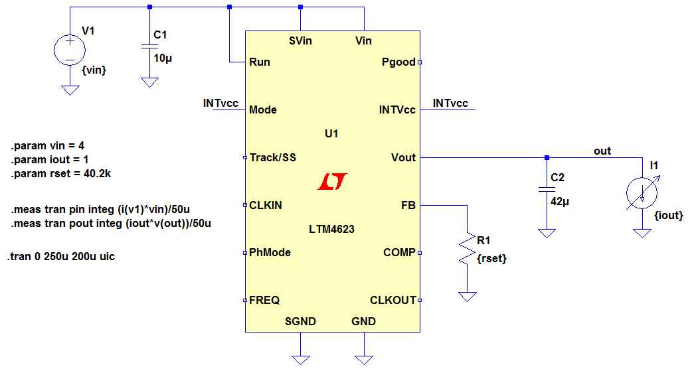

# Example 2

[jupyter version](https://github.com/cstook/LTspice.jl/blob/master/docs/src/example2.ipynb)

In this example, the efficiency of a LTM6423 will be measured vs Vin and Iout.



Import modules.  For the plot `Plots` and `PyPlot` modules are used.
```@example 2
using LTspice, Plots
pyplot()
```

Create an instance of `LTspiceSimulation`.
```@example 2
example2 = LTspiceSimulation("example2.asc",tempdir=true)
```

Define the values of vin and iout to test.
```@example 2
vin_list = linspace(6.0,20.0,10)
iout_list = linspace(0.5,3.0,4)
```

Loop over vin and iout measuring efficiency.  Vout is fixed at 3.3V.
```@example 2
rfb(vout)= 0.6*60.4e3/(vout-0.6)
function compute_efficiency_array(vin_list, iout_list, vout)
    efficiency = Array{Float64}((length(vin_list),length(iout_list)))
    for vin_index in eachindex(vin_list)
        for iout_index in eachindex(iout_list)
            (pin,pout) = example2(vin_list[vin_index],iout_list[iout_index],rfb(vout))
            efficiency[vin_index,iout_index] = -pout/pin
        end
    end
    return efficiency
end
@time efficiency = compute_efficiency_array(vin_list, iout_list, 3.3)
```

Plot the results.
```@example 2
plt = plot()
for iout_index in eachindex(iout_list)
    plot!(plt,vin_list,efficiency[:,iout_index],label = "Iout="*@sprintf("%2.2f",iout_list[iout_index]))
end
plot!(plt, title = "LTM6423 Efficiency @ Vout = 3.3V")
plot!(plt, xlabel = "Vin (V)", ylabel = "Efficiency")
savefig(plt,"example2.svg"); nothing # hide
```


