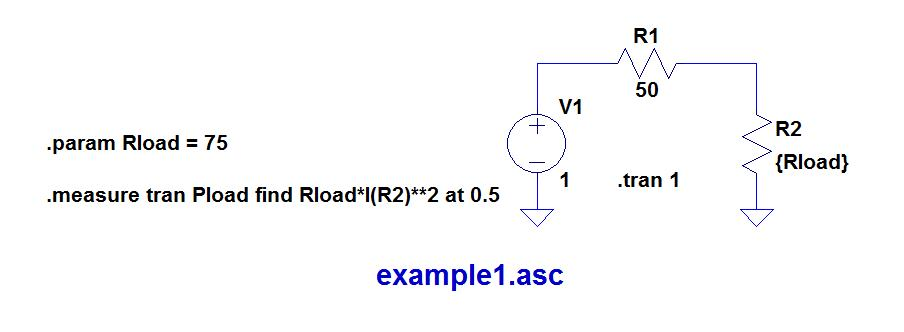

# [Example 1](https://github.com/cstook/LTspice.jl/blob/master/examples/example%201/example1.ipynb)



Import the module.
```julia
using LTspice
```

Create an instance of LTspiceSimulation.
```julia
circuitpath = "example1.asc"
example1 = LTspiceSimulationTempDir(circuitpath)
```

Access parameters and measurements using their name as the key.

Set a parameter to a new value.
```julia
example1["rload"] = 20.0  # set parameter Rload to 20.0
```

Read the resulting measurement.
```julia
loadpower = example1["pload"] # run simulation, return Pload
```

Circuit can be called like a function
```julia
loadpower = example1(100.0)  # pass Rload, return Pload
```

Use [Optim.jl](https://github.com/JuliaOpt/Optim.jl) to perform an optimization on a LTspice simulation

```julia
using Optim
result = optimize(rload -> -example1(rload)[1],10.0,100.0)
rload_for_maximum_power = example1["rload"]
```

# Additional Information

[LTspice.jl API](https://github.com/cstook/LTspice.jl/blob/master/docs/src/api.md)

[Introduction to LTspice.jl](https://github.com/cstook/LTspice.jl/blob/master/docs/src/introduction.ipynb)